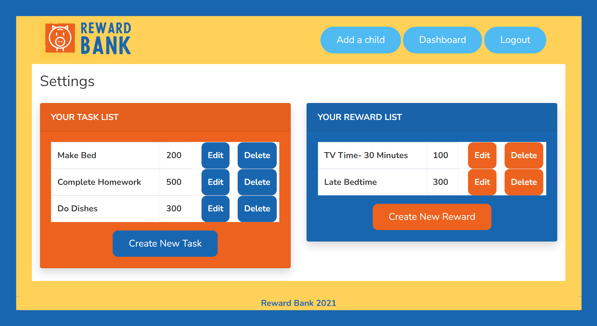

# Reward Bank

## Description
As the world begins to move more and more towards digital currency and away from physical, Reward Bank strives to teach children the importance of money management that reflects how we now interact with money.

 

 

Table of Contents |
-------------------|
[Installation](#Installation)
[Usage](#Usage)
[Screenshots](#Screenshots)
[License](#License)
[Contributing](#Contributing)
[Authors](#Authors)
[Questions](#Questions)

 

## Installation

In order to run the project locally for development and testing, ensure that dependencies are installed by running:

`npm install`

 

## Usage

The aim of Reward Bank, as stated above, is to have a starting point for children to learn how to handle money within the now more increasing digital world. Given the increase in digital transactions, with more people going cashless, Reward Bank came from wanting to find a way to teach children financial responsibility that is more reflective of how the majority of the population handles transactions.

In order to start using Reward Bank, follow the link below for the deployed website. From there, set up your account and the associated child accounts. From there, as a parent, enter in the tasks that you'd like to see your child complete along with a certain amount of points. There isn't any set rule on how much a point is worth--feel free to engage your child in the process of setting up how much they're earning from each task!

Then the part any kid will love: setting up the reward list. Like the task like, you'll be entering the rewards that you'll hand out and the amount of points each reward is worth. Look back on how much you set each of the tasks to get an idea of how much you want each reward to be worth. Assign the tasks to your child through your account and see it pop up on their end waiting to be completed.

As your child completes their tasks, they can log into their own account and mark them as completed. This then gets sent back to you as the parent to approve (or ask to recomplete) and gives your child points that they'll collect in their virtual bank. As their bank grows they can start looking at the rewards and their associated cost to see how much more they'll need to get a late bedtime, or 30 blissfully uninterrupted minutes on the TV.

 
 

You can find the deployed link and the repository link below:

Deployed Link: [Deployed on Heroku](https://rocky-dawn-18669.herokuapp.com/#)

Video Walkthrough: [Video Link](https://drive.google.com/file/d/1eAxeo5jNlSgj4ZRVid00cdQkMwffEidJ/view?usp=sharing)

Repo Link: [Repo Link](https://github.com/UTBootCampGroup2Project2/reward-bank)

 

## Screenshots

 

##  License

The license for this project is MIT. For full details, refer to the [License.MD](LICENSE) file within the repository.

 

## Contributing

If you are interested in contributing to the project, feel free to reach out. Contact information can be found in the [Questions](#Questions) section.

 

## Authors

Andaleeb Farooq: [:octocat:](https://github.com/cerafinn)  
Brandon Burton: [:octocat:](https://github.com/Menkoi)  
Brian Wang: [:octocat:](https://github.com/BrianCKWang)  
Hayley Vuylsteke: [:octocat:](https://github.com/hayleyvuylsteke)

 

## Questions

If you have any questions or issues, feel free to reach out to us either through the repo ([repo link](https://github.com/UTBootCampGroup2Project2)) or through our respective github accounts listed above.
